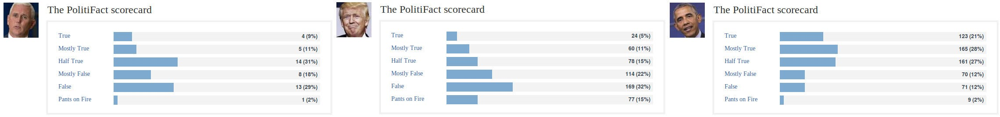
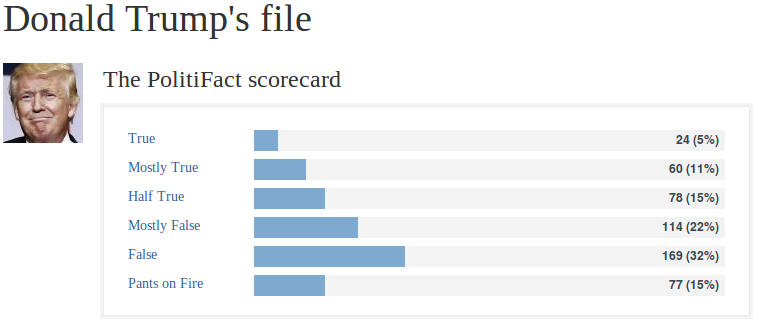

**This article was first posted on [Medium](https://medium.com/captainfact/fact-checking-et-score-de-credibilite-politifact-9cf9e4b6cab1)**.

-------------------------------------------------

 

C'est une demande qui revient régulièrement sur [CaptainFact](https://captainfact.io) : pourrait-on calculer, à posteriori du fact-checking, une note qui jugerait de la factualité des intervenant·e·s ?

Loin d'être de l'ordre de la science-fiction, cette idée est en fait déjà appliquée outre-atlantique par le site [politifact.com](http://www.politifact.com/) qui met en avant ses statistiques de vérification par personnalité. On y découvre que [Donald Trump](http://www.politifact.com/personalities/donald-trump/) ne dit la vérité que sur 31% des affirmations vérifiées par le service là où son prédécesseur [Barack Obama](http://www.politifact.com/personalities/barack-obama/) est à 76%.

Bien qu'elle puisse sembler attirante pour trier l'information plus vite, l'idée d'un score de crédibilité est aussi dangereuse qu'elle est probablement inefficace et ce même (surtout ?) si le travail de vérification est fait de manière collaborative, en encourageant la confrontation des sources comme nous cherchons à le faire sur *CaptainFact*.

## Toutes les fausses informations ne se valent pas

Faire une erreur en annonçant des chiffres surréalistes sur les importations de produits laitiers n'a pas le même impact que de nier l'existence des chambres à gaz. Chez PolitiFact on ne s'encombre pas de cet aspect : une affirmation est vraie, plutôt vraie, à moitié vraie, plutôt fausse, fausse, ou un gros bobard. La nature de ce bobard importe peu : [inventer une fraude électorale](http://www.politifact.com/california/statements/2016/nov/28/donald-trump/pants-fire-trumps-claim-about-california-voter-fra/), [multiplier par trois le nombre d'immigrés](http://www.politifact.com/truth-o-meter/statements/2016/sep/01/donald-trump/donald-trump-repeats-pants-fire-claim-about-30-mil/) ou [prétendre à tort que les pubs de McCain lors des élections étaient plutôt négatives](http://www.politifact.com/truth-o-meter/statements/2008/dec/03/barack-obama/no-mccains-ads-havent-all-been-negative/) vous vaudront tous les trois un *"Pants on fire"* - le bonnet d'âne de la fake news chez PolitiFact.

## Sélectionner les informations qu'on vérifie, c'est attribuer un score subjectif

[Pour être sélectionnée](http://www.politifact.com/truth-o-meter/article/2018/feb/12/principles-truth-o-meter-politifacts-methodology-i/#How%20we%20choose%20claims), une affirmation doit d'abord attirer l'attention d'un·e journaliste, d'un lecteur ou d'une lectrice (un tiers de leurs publications sont issues de suggestions). Elle doit ensuite répondre à un ou plusieurs des critères suivants :

- Être vérifiable
- Être trompeuse ou sonner fausse
- Être significative (les erreurs mineures ou une langue qui fourche de manière évidente sont ignorées)
- Être sujette à partage ou à répétition par le public
- Une personne typique peut être amenée à se questionner sur sa véracité

Même en admettant une totale impartialité des journalistes, la mise de côté de leurs biais idéologiques et la parité de leurs propres lectures, on peut raisonnablement penser que ces règles poussent à privilégier la vérification des affirmations qu'on pense être fausses.

Aucun effort ne semble en tous cas être fait pour apporter une vérification systématique et quand bien même la volonté serait là, vérifier toutes les affirmations d'un·e intervenant·e n'est ni faisable ni souhaitable.

Mais que peut bien vouloir dire ce score s'il ne prend pas en compte 100% des affirmations vérifiables ?

## L'interprétation

Malgré le fait que la représentativité de ces vérifications ne soit nulle part garantie, PolitiFact ne se gêne pas pour présenter ses scores comme un **"Truth-O-Meter"**. Autrement dit, un appareil de mesure de vérité. Une mesure si scientifique et objective qu'elle leur permet même de [comparer les candidats entre eux](http://www.politifact.com/truth-o-meter/lists/people/comparing-hillary-clinton-donald-trump-truth-o-met/) !

Et tant pis si quand **PolitiFact** annonçait en 2016 30.5% d'affirmations fausses chez les **démocrates** (à l'exception d'Obama) là où son équivalent du [Washington Post Fact Checker](https://www.washingtonpost.com/news/fact-checker/) arrivait lui à un chiffre de 57.1% - soit presque deux fois plus (source: [American Press Institute](https://www.americanpressinstitute.org/wp-content/uploads/2016/10/2016-apsa-politifact.pdf)).

**C'est pourtant ici que réside la question la plus importante : Comment le public va-t-il interpréter cette note ? Quelle information va-t-il en retirer ?**

[Une petite recherche sur Twitter](https://twitter.com/search?q=politifact%20scorecard) permet de constater que beaucoup d'utilisateurs perçoivent effectivement ce score comme **une mesure absolue** qui leur permet de comparer de manière crédible qui ment le plus entre Trump et Obama, entre démocrates et républicains :

Un exemple typique : trois affirmations classées comme fausses sur PolitiFact suffisent pour être fiché comme un menteur compulsif, et le simple fait de citer l'individu invalide l'ensemble du propos.

Le travail de fact-checking n'est ici plus utilisé pour construire une argumentation factuelle mais pour servir un message idéologique dont le score constitue l'argument d'autorité. Score dont la légitimité reste à prouver.

## Dear PolitiFact, please focus on your job 💛

Le travail de fact-checking de PolitiFact est précieux. Sa valeur ajoutée réside dans la vérification de points précis et potentiellement délicats par des équipes dont l'efficacité a plusieurs fois été saluée.

Offrir aux lecteurs un résumé grossier, une caricature, par un pourcentage dont **la fiabilité statistique ne saurait être démontrée** semble aller à l'encontre de cette mission.

Coller des étiquettes sur des médias et des individus en se basant sur des données discutables ne semble définitivement pas être une bonne chose à faire si l'on espère agir avec la confiance du public.
